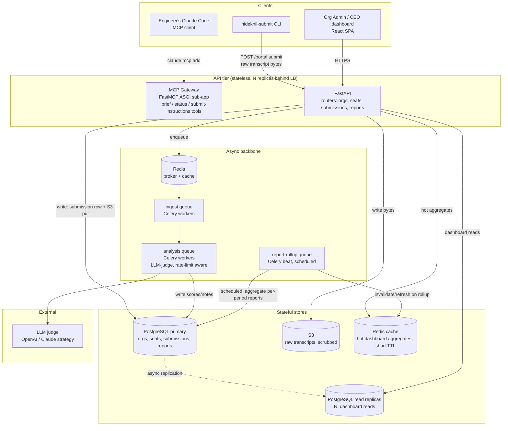
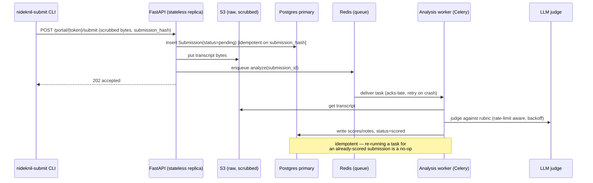
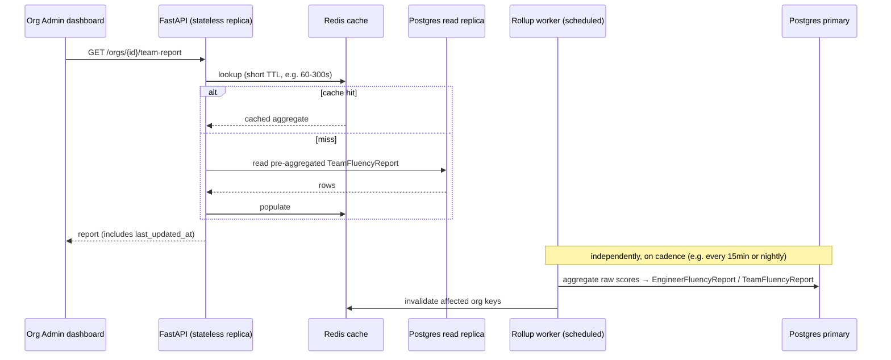

# HLD: AI Fluency for Engineering Teams — Scalable Architecture

Status: Draft v1 — 2026-07-05
Scope: architecture for the product defined in [PRD_ai_fluency_teams.md](./PRD_ai_fluency_teams.md).
Builds on the existing platform stack documented in [TECHNICAL_DESIGN.md](./TECHNICAL_DESIGN.md) (FastAPI
monolith, Postgres+pgvector, Redis+Celery, S3) — this is additive, not a rewrite.

## 1. Scale targets → what they actually mean for this product

Stated target: **1,00,000 candidates/engineers, 1,000 recruiters/org-admins active at the same time.**
Translating that into load this specific product generates (it's a different traffic shape than the
ranking funnel — write-bursty and read-heavy on different axes):

| Actor | Count | Behavior | Traffic shape |
|---|---|---|---|
| Engineers (seats) | 1,00,000 | Submit transcripts on a weekly/monthly cadence via CLI/MCP | **Write-bursty**: not steady — spikes around "end of week/sprint", near-zero otherwise |
| Org Admins / CEOs | 1,000 concurrent | View team dashboards, drill into reports, browse Playbook | **Read-heavy**, low write volume, latency-sensitive (dashboard must feel instant) |
| Analysis pipeline | derived | One LLM-judge pass per submitted session | **Background/async**, cost- and rate-limit-bound, not user-latency-bound |

Back-of-envelope, weekly cadence, evenly distributed (worst case is *not* evenly distributed — see §5):
- 1,00,000 submissions/week ≈ 14,300/day ≈ **0.17 writes/sec average**, but realistically 80% of
  submissions land in a ~4-hour Friday-afternoon/Monday-morning window → **~7 writes/sec peak**, still
  modest for a single Postgres primary, but the *analysis* fan-out behind each write (LLM calls) is what
  actually needs to scale — see §4.
- 1,000 concurrent dashboard viewers, each polling/loading a handful of aggregate queries → this is the
  binding constraint, not engineer writes. It's a **classic read-scaling problem**: identical, cacheable,
  slightly-stale-is-fine aggregate data (team score trend, Playbook feed) requested by many people at once.

**Conclusion up front:** this system is read-scaling-dominated on the dashboard side and
queue-buffering-dominated on the ingestion side. Neither side needs synchronous strong consistency across
the whole system — which is exactly what makes a clean CAP split possible (§3).

## 2. Component architecture

**Why this shape, mapped to the two scale numbers:**
- **1 lakh engineer writes** are absorbed by the queue (`QI`/`QA`), not the API request path — a
  submission POST does the minimum synchronous work (scrub, store raw bytes, insert a `pending` row,
  enqueue) and returns immediately. This is the same pattern already proven for the ranking funnel
  (`202 + poll`) and the existing fluency-assignment pipeline — reused, not reinvented.
- **1,000 concurrent admin reads** are absorbed by **read replicas + a cache layer**, never the primary.
  Dashboards read denormalized, pre-aggregated `TeamFluencyReport` rows (built by the scheduled rollup
  worker), not live joins across raw sessions — so a dashboard load is O(1) lookups, not O(engineers).

## 3. CAP theorem — explicit tradeoffs per subsystem

CAP forces a choice **only during a network partition**: you cannot have both full Consistency and full
Availability. The right move is not "pick CP or AP for the whole system" — it's to classify each piece of
state by whether staleness is tolerable, and choose per-piece. This system has three distinct consistency
domains:

| Subsystem | Choice | Why | What breaks under partition |
|---|---|---|---|
| **Org/seat/auth data** (who can submit, token validity) | **CP** (Postgres primary, single writer, `FOR UPDATE` where needed — same pattern as the existing job-apply lock) | Getting this wrong means either a revoked seat can still submit (security) or a valid engineer is wrongly blocked (trust). Both are worse than a short unavailability window. | If the primary is unreachable, submission/auth **fails closed** (reject, ask retry) rather than accepting on stale/guessed permissions. |
| **Submission ingestion** (raw transcript bytes + the fact that a submission happened) | **AP-leaning, at-least-once** — write to S3 + enqueue can tolerate a partitioned queue by buffering; the CLI's own retry + idempotency key (submission hash) absorbs duplicates. | An engineer's work should never be silently lost because a downstream service hiccuped. Availability of the *write* path matters more than immediate consistency of *when* it gets scored. | Analysis may be delayed (queue backs up), but the submission itself is durably accepted (S3 write + outbox row) before the queue is touched — matches the existing "outbox pattern" already flagged as a TODO in [TECHNICAL_DESIGN §9.8](./TECHNICAL_DESIGN.md#98-reliability--correctness-patterns-for-distribution). |
| **Analysis pipeline output** (per-session scores) | **CP within the pipeline, eventually-consistent to readers** — the judge write to Postgres is a normal ACID transaction (CP), but it's fine for a report to reflect a session scored 30 seconds or 3 minutes ago. | No reader needs the *very latest* score instantly; the value is trend-over-weeks, not real-time. | If replicas lag, dashboards show slightly stale (but internally consistent) data — acceptable and disclosed via a `last_updated_at` timestamp on every report. |
| **Dashboard reads / rollup reports / Playbook feed** | **AP** — served from read replicas + Redis cache, explicitly eventually consistent (rollup runs on a schedule, e.g. every 15 min or nightly depending on cadence tier). | This is the 1,000-concurrent-reader hot path. Optimizing for strict consistency here would mean every dashboard load pays a synchronous-replication cost across 1,000 concurrent viewers for data that changes at most weekly — that tradeoff makes no sense. | If a replica is partitioned from the primary, it keeps serving its last-known-good snapshot rather than erroring — availability wins, staleness is bounded and visible. |

**One-line summary of the design principle:** *identity/authorization is CP because being wrong is a
security incident; everything else in this product (submissions, scores, reports) is AP with
at-least-once delivery and idempotent writes, because the product's actual value (a weekly/monthly trend)
tolerates seconds-to-minutes of staleness and must never sacrifice availability for a submission that took
an engineer real effort to produce.* This mirrors how the existing ranking funnel already behaves (daily
cache = intentional staleness; `FOR UPDATE` only around the one place — apply/displacement — where being
wrong is a correctness bug, not a UX nit).

## 4. Key flows

### 4.1 Submission → analysis (write path, must survive 1 lakh-seat bursts)

- **Idempotency key** = hash of (org, seat, transcript bytes) so CLI retries under load never double-count.
- **Backpressure**: the analysis queue is separate from the ingest queue (mirrors the existing recommendation
  in [TECHNICAL_DESIGN §9.3](./TECHNICAL_DESIGN.md#93-task-queue-from-one-worker-to-an-elastic-fleet) to
  split `rank`/`ingest` queues) — a burst of 1 lakh submissions in one afternoon queues cleanly; workers
  autoscale on queue depth (KEDA/HPA), LLM calls stay within provider rate limits via a token-bucket, same
  approach already used for `bulk_ingest`.

### 4.2 Dashboard read (1,000 concurrent admins, must feel instant)

- Dashboards **never** run a live aggregation query across raw sessions at request time — that's what
  breaks at 1,000 concurrent users. They read a small, pre-computed row per org/team, which is what makes
  this cheap to cache and cheap to replicate.

## 5. Handling non-uniform load (the real risk, not the average)

The average (~7 writes/sec) is not the risk — the **synchronized burst** is: if every org sets the same
Friday-5pm cadence reminder, 1 lakh engineers may submit within the same 2-hour window.
- **Jitter the reminder**: stagger each org's cadence reminder by a deterministic hash of `org_id` across
  the week/day, rather than one global "Friday 5pm for everyone" — spreads load without hurting the product
  (an engineer doesn't care if their reminder lands Thursday vs Friday).
- **Queue absorbs the rest**: even without jitter, the ingest path (§4.1) is designed so a burst just makes
  the queue longer, not the API slower — the synchronous request work per submission is O(1) (scrub +
  store + enqueue), so 7/sec average or 700/sec burst both return in the same ~constant time; only the
  *time-to-scored* (not time-to-accepted) grows during a burst, which is invisible to the engineer.
- **LLM rate limits are the real ceiling**, not the app tier — same conclusion as the existing ranking
  funnel's cost/throughput section. Model tiering (cheaper judge model for the bulk of sessions, escalate
  only flagged/ambiguous ones to a stronger model) is the lever if 1 lakh seats all submit weekly and LLM
  cost/throughput becomes binding.

## 6. Multi-tenancy at this scale

1,00,000 engineers implies hundreds to low-thousands of orgs. Isolation approach:
- **Row-level tenancy** (`org_id` on every table), not schema-per-tenant — schema-per-tenant doesn't scale
  operationally past a few hundred tenants (migrations become O(tenants)). Enforce via Postgres **row-level
  security policies** keyed on `org_id`, not just application-level filtering, so a bug in one query path
  can't leak cross-org data — this is the one place worth the extra rigor given the trust model in the PRD.
- **Partition hot tables by `org_id` hash** once `submissions`/`session_scores` grow large (same
  partitioning move already flagged for `applications`/`candidate_rankings` in the existing scaling
  roadmap) — keeps any one large org's data from degrading query plans for everyone else.
- **Noisy-neighbor protection on the queue**: a per-org rate limit on enqueue (token bucket in Redis) so
  one org's 5,000-seat burst can't starve a smaller org's submissions during the same window.

## 7. What's reused vs. new (infra level)

| Layer | Reused from existing platform | New for this product |
|---|---|---|
| API framework, auth pattern | FastAPI, JWT-style stateless auth (adapted to a static per-seat bearer token, same shape as `RecruiterMcpApiKey`) | Org/seat models, MCP gateway routes |
| Async execution | Celery + Redis, `202 + poll`/scheduled-task patterns | Separate `analysis` and `rollup` queues; scheduled rollup (Celery beat) |
| Storage | S3 (transcripts), Postgres (relational) | No new store class needed — pgvector not required here (no ANN search in this product's v1); could reuse it later only if Playbook-entry dedup needs semantic similarity |
| Scaling levers | Everything in [TECHNICAL_DESIGN §9](./TECHNICAL_DESIGN.md#9-scaling-to-production--distributed-systems-roadmap) (PgBouncer, read replicas, partitioning, queue split, model tiering) applies directly — this product doesn't need a different scaling philosophy, just the same one applied earlier because it's read/write-bursty from day one at this target scale, unlike the ranking funnel which scales gradually with corpus growth | Cache-aggregation-first dashboard design (§4.2) is new because org dashboards are a genuinely different read pattern than anything in the existing product |

## 8. Summary: how this hits both numbers without over-building

- **1,00,000 engineers** is handled by treating every submission as a fire-and-forget write into a durable
  queue — the API tier's job is O(1) per request regardless of how many seats exist; only the worker fleet
  needs to scale with volume, and it scales independently and elastically.
- **1,000 concurrent recruiters/admins** is handled by never computing dashboard data live — pre-aggregate
  on a schedule, cache aggressively, read from replicas — so concurrent viewers are a cache-hit-ratio
  problem, not a database-load problem.
- **CAP is respected by not treating the whole system as one consistency domain**: auth/identity is CP
  (fails closed, never wrong), everything else is AP with idempotent, at-least-once semantics (never loses
  an engineer's submission, tolerates a stale-by-minutes dashboard). That split is what lets both scale
  targets be hit without the two goals fighting each other.

## 9. Open items before this is build-ready

- Confirm rollup cadence (15-min vs hourly vs nightly) per pricing tier — affects Redis cache TTL and
  Celery beat schedule design.
- Decide row-level-security policy implementation now vs. app-layer-only filtering for MVP (recommend RLS
  from day one given the trust/consent stakes called out in the PRD, even if it's more setup work upfront).
- Validate LLM provider rate limits against the 1-lakh-seat weekly-cadence worst case before committing to
  "weekly" as a default cadence tier — may need monthly-default + weekly-as-premium if throughput is tight.
