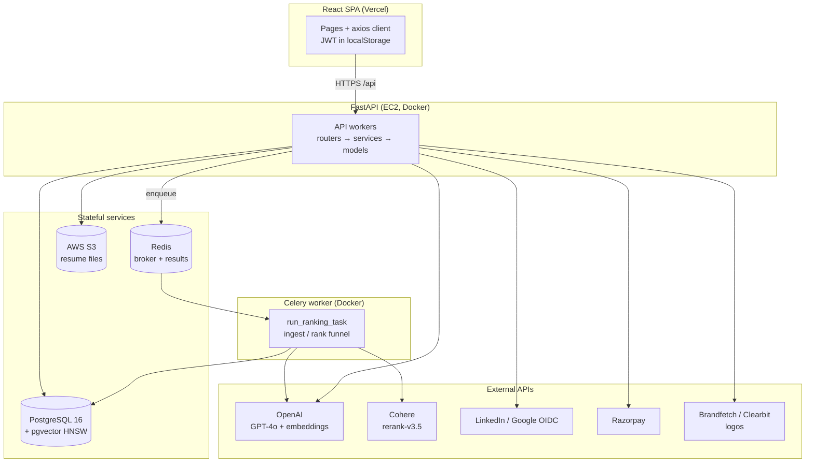
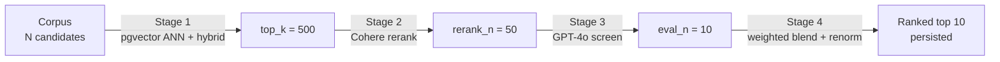
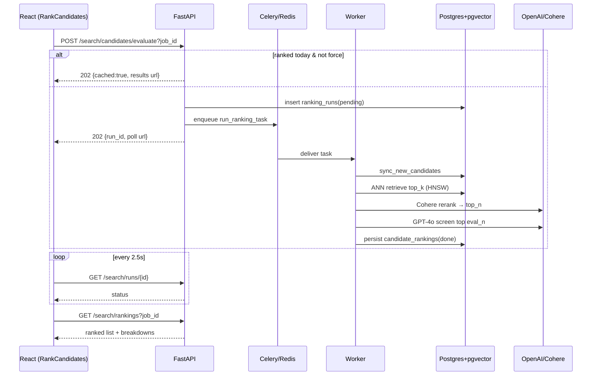
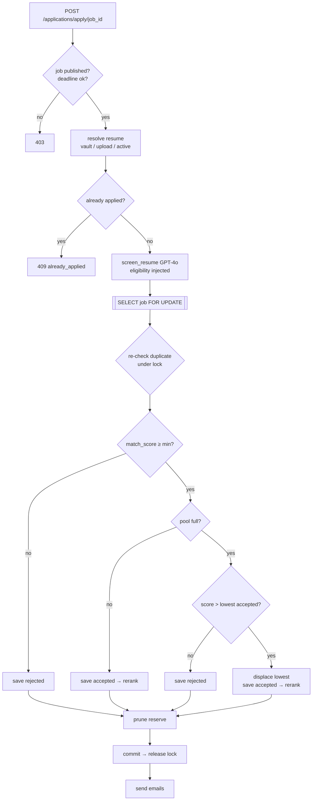
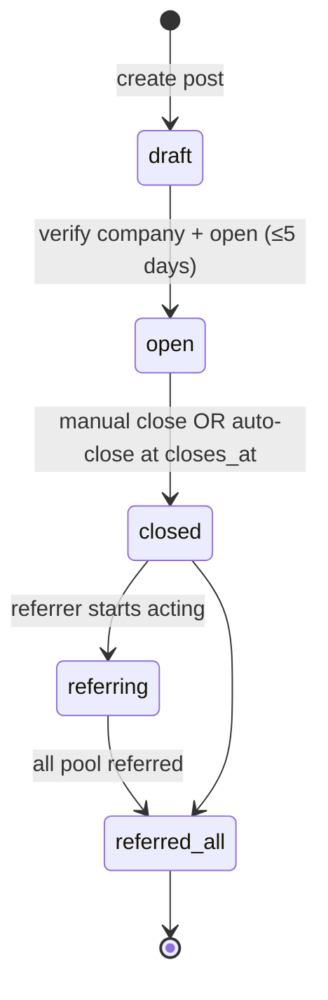
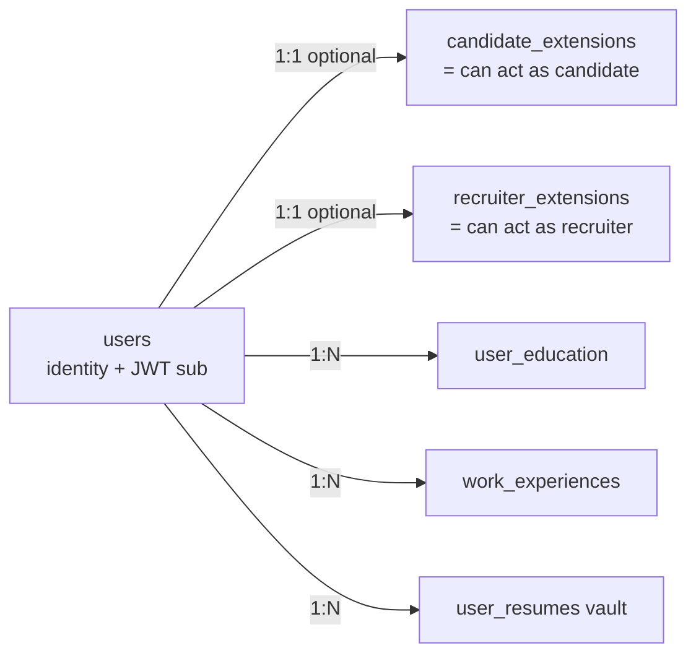
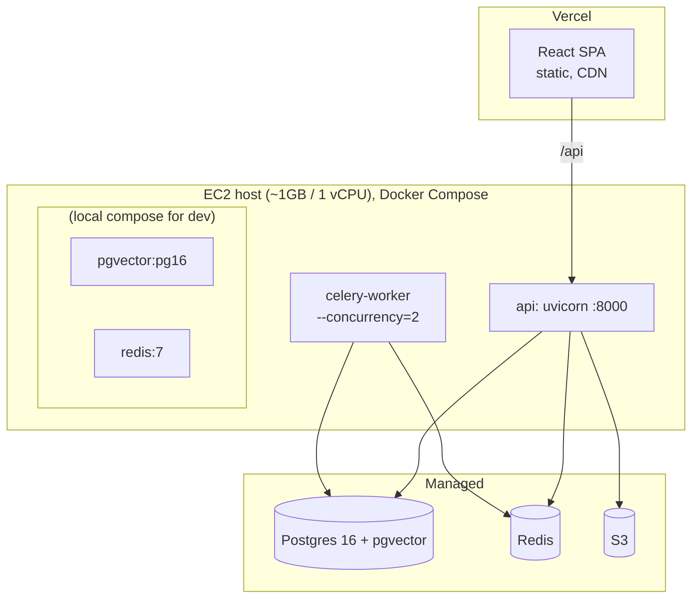

# Nideknil — Technical Design Document

> **Product:** Nideknil (domain `nideknil.in`) — "LinkedIn" spelled backwards. An AI-powered hiring platform whose core is a **LinkedIn-Hiring-Assistant-style retrieval funnel** that ranks candidates for a role in seconds instead of screening every applicant with an LLM.
> **Repo working name:** `Mark1Job` / historical name `TalentAI — Hire Smarter`.
> **Audience:** engineers who want to understand how the whole system fits together, end to end.
> **Status of this doc:** reflects the codebase as of July 2026. HLD covers every feature; LLD is provided for the critical/high-value subsystems; the last section is a distributed-systems scaling roadmap.

---

## Table of Contents

1. [System Overview](#1-system-overview)
2. [Technology Stack & Rationale](#2-technology-stack--rationale)
3. [Architecture at a Glance](#3-architecture-at-a-glance)
4. [Data Model Reference](#4-data-model-reference)
5. [HLD — Every Feature, End to End](#5-hld--every-feature-end-to-end)
6. [LLD — Critical & High-Value Features](#6-lld--critical--high-value-features)
   - 6.1 [The Candidate Ranking Funnel](#61-the-candidate-ranking-funnel-the-crown-jewel)
   - 6.2 [Apply → Pool → Displacement → Reserve](#62-apply--pool--displacement--reserve-pool)
   - 6.3 [Referral Pools & Waitlists](#63-referral-pools--waitlists)
   - 6.4 [Identity, Auth & Dual-Mode Accounts](#64-identity-auth--dual-mode-accounts)
7. [Cross-Cutting Concerns](#7-cross-cutting-concerns)
8. [Deployment Topology](#8-deployment-topology)
9. [Scaling to Production — Distributed Systems Roadmap](#9-scaling-to-production--distributed-systems-roadmap)
10. [Known Gaps & Deferred Work](#10-known-gaps--deferred-work)

---

## 1. System Overview

Nideknil solves **two sides of the hiring cold-start problem**:

| Side | Actor | Problem solved | Core mechanism |
|------|-------|----------------|----------------|
| **Push** | Candidate applies to a job | "Did my resume make the cut?" | Apply → AI screen → limited **acceptance pool** with **displacement** + a **reserve pool** |
| **Pull** | Recruiter ranks a role | "Who are the best 10 people for this role, ranked and explained?" | The **retrieval funnel**: embed → ANN retrieve → rerank → LLM eval → blended score |
| **Referral** | Employee refers for their company | "Find a willing referrer without cold-messaging 100 people" | Verified **referral posts** with ranked **pool + waitlist** |

Everything is built on **one Python/FastAPI backend** and **one React SPA**, sharing a Postgres+pgvector database and a Redis-backed Celery queue. There is deliberately **no microservice split** yet — the system is a well-factored modular monolith (routers → services → models), which is the right altitude for the current scale and keeps the path to service extraction clean.

### Design philosophy baked into the code

- **The LLM is the scarce resource.** The entire ranking architecture exists so the LLM only ever sees the top ~10–20 candidates, never the whole corpus. Cheap stages (vector, rerank) do the culling.
- **Ingestion is decoupled from ranking.** Candidates are extracted + embedded at resume-upload time (background task), so a "rank now" click is fast and O(top_k), not O(corpus).
- **Every expensive result is cached or made idempotent.** Daily rank cache, SHA-256 resume-hash dedup for extraction, `inputs_hash` for composite scores, embedding LRU cache.
- **Portable source of truth + optimization layer.** Embeddings live in portable `TEXT`/JSON columns; Postgres-only `vector(1536)` columns are a synced optimization for ANN, so the app still runs on SQLite for local dev.

---

## 2. Technology Stack & Rationale

### Backend

| Concern | Choice | Why |
|---------|--------|-----|
| Language / framework | **Python 3.11 + FastAPI 0.115** | Async-native, Pydantic validation, first-class OpenAPI/Swagger. Chose to **keep Python, not rewrite in Go** (an earlier PRD proposed Go) — the AI ecosystem lives in Python. |
| ORM | **SQLAlchemy 2.0** | Dialect-aware (SQLite locally, Postgres in prod), mature, explicit. |
| Primary DB | **PostgreSQL 16 + `pgvector`** | One store for relational + vector data. Avoids a separate vector DB at current scale; HNSW indexes give fast ANN. |
| Vector search | **pgvector HNSW, `vector_cosine_ops`** | Cosine-distance ANN over 1536-d embeddings, co-located with the rows. |
| Task queue | **Celery + Redis** (thread fallback) | Offloads the 15–40s ranking funnel from request workers; Redis doubles as broker + result backend. |
| LLM | **OpenAI GPT-4o** (`AI_MODEL`) via a **Strategy pattern** (`AIStrategy` ABC, OpenAI + Claude impls) | Provider-swappable. GPT-4o for screening/extraction; `gpt-4o-mini`/`claude-haiku-4-5` used for cheap side tasks (domain verification). |
| Embeddings | **OpenAI `text-embedding-3-small`** (1536-d) | Cheap, strong retrieval quality. |
| Reranker | **Cohere `rerank-v3.5`** (hosted API) | **Migrated off local `BAAI/bge-reranker-base`** because torch needs ~1.5–2 GB and OOM-killed the 1 GB prod box. Hosted rerank keeps the container tiny. |
| Auth | **JWT (python-jose, HS256)** + **bcrypt** | Stateless tokens; 24h expiry. OAuth via LinkedIn (OIDC) + Google (OIDC). |
| File storage | **AWS S3 (boto3)**, presigned URLs | Resume originals off the app disk; presigned GET for downloads. |
| Payments | **Razorpay** (INR-first market) | SDK present; entitlement layer still to be built. |
| Resume parsing | **pdfplumber, python-docx** | PDF/DOCX/TXT → text. |
| Email | **aiosmtplib** | Async SMTP; logs to console if unconfigured. |

### Frontend

| Concern | Choice |
|---------|--------|
| Framework | **React 18.3 + TypeScript 5.5** |
| Build | **Vite 5.4** (`tsc && vite build`) |
| Routing | **react-router-dom 6.26** (`BrowserRouter`) |
| HTTP | **axios 1.7** — single client, JWT request interceptor, 90s timeout (for long AI calls), 401 → redirect to login |
| Styling | **TailwindCSS 3.4** + custom "Vouch" design system (warm-paper theme, hard-offset shadows) |
| Brand | Sky accent `#4CB2FF`; two-tone "Ni·deknil" wordmark + flip-arrows logomark |
| Hosting | **Vercel** static SPA (`vercel.json` rewrites all → `index.html`); no frontend Dockerfile |

### Infra

- **Local:** `docker-compose.yml` — `pgvector/pgvector:pg16` + `redis:7-alpine`.
- **Prod:** `docker-compose.prod.yml` — `api` (uvicorn) + `celery-worker` (`--concurrency=2`), both from `backend/Dockerfile` (`python:3.11-slim`, no torch). Host is a ~1 GB / 1-vCPU EC2 box.
- **Logs:** Grafana Alloy → Loki shipper is scaffolded but **disabled** (no `config.alloy` in repo yet).

---

## 3. Architecture at a Glance

**Request lifecycle (typical):** SPA attaches `Bearer <jwt>` → FastAPI dependency `get_current_user` decodes it and eager-loads the user + role extensions → router validates ownership/capability → service layer does the work → response. Long jobs (ranking) return **202 + a poll URL** and run on Celery.

---

## 4. Data Model Reference

All tables have an integer `id` PK. **Role is not a column on `users`** — capability is expressed by the *existence* of an extension row (`candidate_extensions` / `recruiter_extensions`), which cleanly supports **dual-mode accounts** (one human who is both a candidate and a recruiter).

### Identity & Auth
- **`users`** — `email` (unique), `hashed_password` (nullable for OAuth-only), `full_name`, OAuth ids (`linkedin_id`, `google_id`, `*_verified`), 2FA (`totp_*`), billing (`plan`, `plan_expires_at`, `razorpay_payment_id`), enrichment (`headline`, `about`, `avatar_url`).
- **`candidate_extensions`** — 1:1 with user; `onboarding_completed`, `resume_text`/`resume_filename` (fast-access active resume), `career_profile` (JSON), `profile_embedding` (JSON), `magic_match_cache`.
- **`recruiter_extensions`** — 1:1; `company`, `is_third_party` (agency flag).
- **`pending_registrations`** — signup awaiting OTP (no `users` row yet); `otp_hash`, `attempts`, `expires_at`.
- **`email_verification_otps`** — work-email OTP for referral verification.
- **`user_education`**, **`work_experiences`** — normalized profile history (FK to `colleges` where matched).

### Resume & structured extraction
- **`user_resumes`** — the resume *vault* (max 3 per user), `file_key` (S3), `is_primary`.
- **`candidate_profiles`** — LLM-extracted structured data keyed by `source_resume_hash` (SHA-256 dedup): `total_yoe`, `work_history`, `raw_skills`, `normalized_skills`, `unmapped_skills`, `education`, `projects`, `certifications`, `confidence_scores`, `taxonomy_version`.
- **`skill_review_queue`** — unmatched skills for taxonomy expansion.

### Jobs & applications (push side)
- **`jobs`** — `title`, `jd_text`, `company`, `max_count` (pool cap), `min_match_score`, `status` (draft/published/closed), `slug`, salary/remote fields, `is_third_party`, campus fields, **JD parsing**: `jd_requirements` (JSON), `jd_parse_status`; **embedding**: `jd_embedding` (TEXT) + `jd_vec vector(1536)`.
- **`eligibility_criteria`** — 1:1 with job (`min_years_experience`, `required_skills`, `required_education`).
- **`job_audit_log`** — field-level change history.
- **`applications`** — `job_id`, `candidate_user_id`, `match_score`, `rank`, `status` (accepted/rejected/displaced), `candidate_status`, `is_archived` (tombstone flag), `status_token` (public status page), analysis fields (`strengths`/`gaps`/`improvement_suggestions`/`project_scores`), `resume_embedding`, `resume_file_key`.

### Ranking funnel (pull side)
- **`candidates`** — the searchable **corpus**, distinct from `users`/`applications`. `recruiter_id` (nullable = platform-wide), `user_id` (nullable, links platform candidates), `source` (platform/upload/application), `profile_summary` + `profile_embedding` (JSON) + `profile_vec vector(1536)`, structured columns mirror `candidate_profiles`, `ingest_status` (parsing/ready/failed).
- **`candidate_rankings`** — persisted funnel output per (job, candidate): per-stage scores (`embed`/`skill`/`keyword`/`rerank`/`llm`/`experience`/`ai_fluency`), `final_score`, `rank`, `recommendation`, LLM `strengths`/`risks`/`summary`, `model_version`. Full replace per run.
- **`ranking_runs`** — async run tracker: `status` (pending/running/done/failed), params (`top_k`/`rerank_n`/`eval_n`), counts, `error`, `completed_at`.
- **`candidate_job_scores`** — immutable composite-score history (E5) with `inputs_hash` idempotency.

### Feedback, referrals, lookups
- **`recruiter_feedback`** — append-only recruiter actions (viewed/shortlisted/contacted/interviewed/rejected/hired) with score/rank snapshots → future learning-to-rank signal.
- **`shortlists`** — mutable current shortlist (unique per job+candidate).
- **`product_feedback`** — user feedback + AI triage (category/priority/sentiment).
- **`referral_posts`** / **`referral_applications`** — see [§6.3](#63-referral-pools--waitlists).
- **`colleges`** / **`college_aliases`** / **`company_logos`** — normalized lookup + shared logo cache.

---

## 5. HLD — Every Feature, End to End

Each feature below: **what it does → who uses it → the cycle (flow) → where it lives in code.**

### 5.1 Identity & Authentication
**What:** Sign up / sign in for candidates and recruiters; dual-mode accounts; admin gating.
**Cycle:**
1. **Email + OTP signup** — `POST /api/auth/register/send-otp` stashes a `PendingRegistration` and emails a 6-digit OTP (SHA-256 hashed, 10-min TTL, 5 attempts). `verify-otp` creates the `User` + the chosen extension and returns a JWT. No `users` row exists until the OTP is verified.
2. **Password login** — `POST /api/auth/login` → bcrypt verify → JWT. OAuth-only accounts (null hash) can't password-login.
3. **OAuth** — LinkedIn (`/api/auth/linkedin/*`) and Google (`/api/auth/google/*`) OIDC. Callback matches identity by provider id then email, ensures the requested extension, issues a JWT, redirects to the SPA with `?token=...`.
4. **Dual-mode** — `POST /api/auth/add-capability` adds the other extension to an existing account. The frontend keeps an `active_mode` UI preference; capability guards (`require_recruiter`/`require_candidate`) check the extension, not the mode.
5. **Admin** — no DB role; `require_admin` checks `ADMIN_EMAILS` allowlist.

**Code:** `routers/auth.py`, `linkedin_auth.py`, `google_auth.py`, `services/auth_service.py`. → **LLD in [§6.4](#64-identity-auth--dual-mode-accounts).**

### 5.2 Candidate Profile & Resume Vault
**What:** A candidate's career home — resumes, work history, education, a generated career profile.
**Cycle:**
1. Upload resume (`POST /api/profile/resume`): parse (pdfplumber/python-docx, ≥50 chars) → upload original to S3 → add to **vault** (`user_resumes`, max 3, oldest evicted) → refresh the fast-access copy on `candidate_extensions` → **invalidate** cached career profile + embedding.
2. Two background tasks fire: `_update_profile_embedding` and **`prepare_candidate`** (materializes the candidate into the searchable `candidates` corpus — this is what makes later ranking fast).
3. `set-active` / `delete` vault operations re-sync the fast-access copy and re-materialize.
4. `POST /api/profile/refresh-career` regenerates the `career_profile` via the LLM.
5. Work-experience and education have full CRUD + "import from resume".

**Code:** `routers/profile.py`, `services/corpus_sync.py`, `services/file_parser.py`, `services/storage_service.py`.

### 5.3 Structured Resume Extraction & Skills Taxonomy
**What:** Turn free-text resumes into structured, queryable data with normalized skills.
**Cycle:**
1. `POST /api/resume-profile/extract` — SHA-256 hash the resume; if a `candidate_profiles` row exists for `(user, hash)`, return it (no LLM call).
2. Else call `extract_structured_profile` (GPT-4o, JSON mode, temp 0.0, 3-retry loop) → full_name/yoe/work_history/raw_skills/education/projects/certifications/confidence_scores.
3. `normalize_skills(raw_skills)` maps against **`data/skills_taxonomy.json`** (527 canonical skills, 1590 aliases; e.g. `k8s→Kubernetes`, `JS→JavaScript`) via an O(1) lru-cached reverse map. Unmapped skills go to `skill_review_queue`.
4. Persist with `taxonomy_version` for reproducibility.

**Code:** `routers/resume_profile.py`, `services/ai/openai_strategy.py`, `services/skills_normalizer.py`.

### 5.4 Job Posting & JD Parsing
**What:** Recruiters create/manage roles; JDs are parsed into structured requirements the whole ranking stack reads.
**Cycle:**
1. `POST /api/jobs/` — accepts `jd_text` or a `jd_file` (parsed); JD must be ≥100 chars; slug generated; status `draft`/`published`.
2. **Third-party enforcement**: if the recruiter's `company` is set and the job isn't flagged `is_third_party`, `company` must match the recruiter's employer (403 otherwise) — prevents posting jobs for companies you don't represent.
3. **Company logo** resolved in the background (cache → `company_url` → Brandfetch/Clearbit by name).
4. **JD parsing (E5-S1)**: on publish (or JD change), `jd_parse_status="pending"` + background `parse_job_requirements` → `parse_jd_requirements` (GPT-4o) fills `jd_requirements` (skill groups any/all, preferred skills, min/max years, seniority). This structure powers the skill-match weight in retrieval, the rerank query, and the composite scorer.
5. `PATCH` audits changed fields to `job_audit_log`; publish/unpublish toggles `status`.

**Code:** `routers/jobs.py`, `services/jd_parser.py`.

### 5.5 Candidate Apply (Push Side)
**What:** A candidate applies; gets an instant AI verdict; enters a capped, self-balancing pool.
**Cycle (summary):** resolve resume → inject eligibility criteria into the JD → `screen_resume` (GPT-4o) → compare `match_score` to `min_match_score` and the pool → accept / reject / displace → re-rank → prune the reserve pool → email. All under a per-job row lock.
**Code:** `routers/applications.py`, `services/ai/openai_strategy.py`. → **LLD in [§6.2](#62-apply--pool--displacement--reserve-pool).**

### 5.6 Candidate Ranking Funnel (Pull Side) — the core product
**What:** A recruiter picks one of their jobs and gets the top ~10 candidates from the whole corpus, each scored across 5 dimensions and explained.
**Cycle (summary):** `POST /api/search/candidates/evaluate` returns **202** with a poll URL (or today's cached result). A background run executes: sync new candidates → **pgvector ANN retrieve top 500** → **Cohere rerank to top 50** → **LLM-evaluate top 10** → **blended final score** → persist. Frontend polls `/runs/{id}` then reads `/rankings`.
**Code:** `routers/search.py`, `services/{funnel,retrieval,reranker,evaluation,corpus_sync,candidate_ingest,pgvector_sync}.py`. → **LLD in [§6.1](#61-the-candidate-ranking-funnel-the-crown-jewel).**

### 5.7 Composite Scoring & Semantic Skills (E5)
**What:** A deterministic, auditable 4-part suitability score (distinct from the LLM screen and the funnel blend).
**Cycle:** `POST /api/scores/compute` (recruiter) → requires a `candidate_profiles` row + parsed `jd_requirements` → idempotency check via `inputs_hash` → run 4 sub-scorers concurrently: **Skills (30) + Experience (30) + Education (20) + Projects (20)**, capped at 100 → store an **immutable** `candidate_job_scores` row (new row per run, `model_version` in the hash). `/api/semantic/*` exposes each sub-score for transparency/debugging; semantic skill matching uses embeddings with `SKILL_MATCH_THRESHOLD=0.75` and an embedding LRU cache.
**Code:** `services/composite/scorer.py`, `routers/scores.py`, `routers/semantic.py`.

> **Three scoring systems, don't conflate them:** (a) the **funnel final score** (`evaluation.py`, 5-factor blend), (b) the **LLM `match_score`** inside `screen_resume` (skills·0.35 + projects·0.30 + experience·0.35, with experience-ratio caps) used at apply time and as the funnel's "assessment" factor, and (c) the **deterministic composite** (E5, 30/30/20/20). They serve different surfaces.

### 5.8 AI Fluency
**What:** A ranking dimension measuring how well a candidate *uses AI to do their work* (0–100).
**Cycle:** derived inside `screen_resume` (returns `ai_fluency: {score, signals, rationale}` on a 0–100 rubric); the funnel blends it at **15%** and stores it on `candidate_rankings`. Roadmap: richer signals from a BYO chat-export analysis and a live sandboxed agent challenge (candidates free; recruiters metered — see monetization).
**Code:** `services/ai/openai_strategy.py`, `services/evaluation.py`.

### 5.9 Employee Referrals
**What:** Verified employees open referral posts; candidates apply into a ranked **pool + waitlist**; no cold outreach.
**Cycle (summary):** create draft → verify company (LinkedIn or work-email OTP) → open (auto-closes ≤5 days) → candidates apply and are ranked into pool/waitlist with displacement → referrer marks "referring" → "referred all" (terminal).
**Code:** `routers/referrals.py`. → **LLD in [§6.3](#63-referral-pools--waitlists).**

### 5.10 Recruiter Feedback Loop & Shortlists
**What:** Capture recruiter actions on ranked candidates as training signal + manage a shortlist.
**Cycle:** `POST /api/feedback` logs an append-only action (viewed/shortlisted/contacted/interviewed/rejected/hired) and **snapshots** the candidate's `final_score`/`rank` at that moment; `shortlisted` adds to `shortlists`, `rejected`/`ignored` removes. The snapshots are the eventual learning-to-rank dataset.
**Code:** `routers/feedback.py`.

### 5.11 Reserve Pool (recruiter application view)
**What:** Replaces a flat "rejected" dump with **Shortlisted / Reserve (top-15 runner-ups) / Archived**.
**Cycle:** `GET /api/applications/job/{id}/all` returns shortlisted (accepted, by rank), reserve (top `RESERVE_POOL_SIZE=15` non-accepted by score), and an `archived_count`. Recruiter can **Promote** a reserve candidate into the shortlist (may exceed `max_count`). Everyone below the reserve cutoff is **tombstoned** to save space. → **Detail in [§6.2](#62-apply--pool--displacement--reserve-pool).**
**Code:** `routers/applications.py`.

### 5.12 Magic Match (candidate job recommendations)
**What:** Candidates see jobs that fit their profile.
**Cycle:** `GET /api/applications/magic-match` — cosine similarity between the candidate's `profile_embedding` and job `jd_embedding`s, daily-rate-limited via `magic_match_date`/`magic_match_cache` on the extension.
**Code:** `routers/applications.py`.

### 5.13 Colleges & Campus Hiring
**What:** A college directory + campus-only job surface.
**Cycle:** `GET /api/colleges` (with member/alumni counts + logos), `/search` + `/ai-search` (LLM fallback for obscure names), `/{college}/campus-jobs` (access-controlled to recruiters or college members), `/{college}` detail with AI-generated info and talent stats. Colleges are normalized with an alias table so free-text spellings resolve to one record.
**Code:** `routers/colleges.py`, `services/college_resolver.py`.

### 5.14 Company & College Logo Resolution
**What:** Consistent brand logos everywhere, without scraping LinkedIn (ToS/legal risk — explicitly rejected).
**Cycle:** name → domain → logo chain (Brandfetch → keyless Clearbit / Hipolabs → homepage favicon → Google S2). Runs in background tasks; results cached in `company_logos` (deduped by normalized `name_key`). Frontend `<BrandLogo>` renders the logo with a deterministic color-monogram fallback.
**Code:** `services/company_logo.py`, `services/logo_cache.py`, `frontend/src/components/BrandLogo.tsx`.

### 5.15 Product Feedback (AI-triaged)
**What:** In-app feedback with automatic triage.
**Cycle:** `POST /api/product-feedback` (anonymous allowed; mood ∈ love/happy/neutral/frustrated/bug) → AI classifies category/summary/priority/sentiment/affected_area → stored for the admin panel.
**Code:** `routers/product_feedback.py`.

### 5.16 Admin Panel
**What:** Operator view of platform health.
**Cycle:** email-allowlisted (`require_admin`) endpoints: `/overview` (counts), `/feedback` (triaged), `/users`, `/jobs`. Frontend `AdminPanel.tsx` behind an `AdminGate`.
**Code:** `routers/admin.py`, `services/admin_access.py`.

### 5.17 Monetization & Payments (partially built)
**What:** Value-based SaaS pricing (INR-first) for the ranking product.
**State:** Razorpay SDK + config wired; `users.plan`/`plan_expires_at`/`razorpay_payment_id` columns exist. **The entitlement/metering layer is not built yet.** The **daily rank cache already acts as the natural metering unit** (one ranked shortlist per role per day; `force=true` = a paid "refresh"). Planned levers: eval-depth "Deep Evaluation" tier, corpus-size tiers, AI-fluency live-challenge credits.
**Code:** config + model columns present; enforcement TODO. → **[§10](#10-known-gaps--deferred-work).**

---

## 6. LLD — Critical & High-Value Features

### 6.1 The Candidate Ranking Funnel (the crown jewel)

The funnel is a **4-stage cascade**: each stage is more expensive than the last and runs on fewer candidates, so the LLM only ever sees the final ~10.

#### Async execution & daily cache (`routers/search.py`, `services/funnel.py`)

`POST /api/search/candidates/evaluate` is the production entry point. It is a **synchronous endpoint that returns 202** and offloads work:

1. If a `pending`/`running` run exists for the job → return it (no duplicate).
2. Else if not `force` and a `done` run exists **today** (`func.date(created_at) == current_date`) → return **cached** results.
3. Else `start_ranking_run(...)`:
   - creates a `RankingRun(status="pending")`,
   - if `USE_CELERY` → `run_ranking_task.delay(...)` (falls back to a daemon thread if the broker is down),
   - else → `threading.Thread(target=execute_ranking_run, daemon=True)`.

`execute_ranking_run` opens its **own `SessionLocal`**, flips the run to `running`, calls `asyncio.run(run_funnel(...))` in a dedicated event loop (so the blocking Cohere/LLM calls stall only this worker, never the API workers), and records `done`/`failed` + counts + `completed_at`.

The client **polls** `GET /api/search/runs/{run_id}` every ~2.5s, then reads `GET /api/search/rankings?job_id=`.

#### Stage 1 — Retrieval (`services/retrieval.py`)

- **JD vector**: `ensure_job_vector` embeds `jd_text` (if not cached) into `jd_embedding` (TEXT) + mirrors to `jobs.jd_vec`.
- **ANN**: raw SQL over `candidates` where `ingest_status='ready' AND profile_vec IS NOT NULL`, `ORDER BY profile_vec <=> (:qvec)::vector LIMIT :k` — cosine distance via the HNSW index; similarity = `1 - distance`.
- **Hybrid re-score** per candidate:
  `hybrid = 0.70·vector + 0.20·skill_match + 0.10·keyword_match`
  - `skill_match` = |JD normalized skills ∩ candidate normalized skills| / |JD skills|
  - `keyword_match` = |JD keywords ∩ candidate tokens| / |JD keywords|
- The funnel calls this with `recruiter_id=None` → **ranks the whole platform corpus**. (The synchronous `GET /search/candidates` endpoint scopes to the recruiter's own uploads.)

#### Stage 2 — Rerank (`services/reranker.py`)

Cohere `rerank-v3.5`. The hard-won lessons are encoded here:
- **Feed natural-language prose, not skill lists.** Query: `"We are hiring a {title}. The ideal candidate has hands-on experience with {≤25 skills}."` Document: `"{headline} with {yoe} years of experience, skilled in {≤25 skills}."`
- **Exclude `key_responsibilities`** from the query (generic responsibility prose flips a backend job to rank a frontend candidate #1).
- Ask Cohere for **all** documents (`top_n=len`) so every candidate gets a relevance score; truncate to `rerank_n` locally.
- The reranker is a **recall filter (500→50)**, not the final ranker — coarse ordering is fine; the LLM decides precision.

#### Stage 3 — LLM eval (`services/evaluation.py` + `screen_resume`)

- Only `candidates[:eval_n]` (default **10**) reach the LLM. Runs `screen_resume` under `asyncio.Semaphore(5)`, gathered concurrently.
- `screen_resume` (GPT-4o, JSON, temp 0.1) returns skills/projects/experience sub-scores, gaps, suggestions, and `ai_fluency`. The **composite `match_score` is recomputed server-side** (`skills·0.35 + projects·0.30 + experience·0.35`, with experience-ratio caps at 55/70) — the LLM's self-reported total is not trusted.

#### Stage 4 — Final blended score (`compute_final_score`)

Weights (authoritative constants, sum to 1.0):

| Factor | Weight | Source |
|--------|--------|--------|
| **Role Fit** | 0.30 | `0.45·embed + 0.55·rerank` |
| **Skills Match** | 0.25 | Stage-1 skill_match ×100 |
| **Experience** | 0.15 | `min(1, yoe / jd_min_years)` ×100 |
| **AI Fluency** | 0.15 | from `screen_resume` |
| **Overall Assessment** | 0.15 | LLM `match_score` |

- **Renormalization:** non-LLM candidates (that didn't reach stage 3) only have the first 3 factors (weights sum 0.70); `final = Σ(w·v)/Σ(w)` so they aren't unfairly zeroed.
- `recommendation_for(score)`: ≥80 Strong / ≥70 Good / ≥60 Possible / else Weak.
- `persist_rankings` **replaces** all `candidate_rankings` for the job (full recompute each run), `model_version="funnel-v1"`.

> ⚠️ **Doc drift to fix:** the `funnel.py` header comment says "25/25/20/20/10" — that's stale. The `evaluation.py` constants (30/25/15/15/15) are authoritative.

#### Corpus materialization (`services/corpus_sync.py`, `candidate_ingest.py`)

- **At upload time** (`prepare_candidate`, background): `ingest_resume` → `extract_structured_profile` → `normalize_skills` → `build_profile_summary` (a *compact* blurb, ~title + top-20 skills + yoe + industries + projects + education) → **embed the summary, never the full resume** → write structured columns + `profile_embedding` + `profile_vec`. Idempotent per `user_id` (re-ingests only if the resume hash changed).
- **At rank time** (`sync_new_candidates`): ingests only un-materialized candidates, and **only if ≤ 25** — beyond that it defers to the `bulk_ingest` CLI so a rank click never triggers mass extraction. This is what makes per-rank latency **flat (~16s) regardless of corpus size** — bounded by `top_k` rerank + `eval_n` LLM, not by N.

#### Why this design

- LLM cost ≈ **$0.10/rank** (eval_n=10, gpt-4o) and ~$0.007 one-time per candidate ingested — ~95% gross margin against the value of a good hire.
- Latency is decoupled from corpus size → scales to 100k candidates with the same per-rank cost.

---

### 6.2 Apply → Pool → Displacement → Reserve Pool

The push-side flow is a **single transaction per request under a per-job row lock**, so concurrent applies to the same job serialize correctly (distributed-safe on Postgres).

**Key mechanics:**
- **Lock placement:** `_lock_job_for_update` (`SELECT ... FOR UPDATE`) is taken **after** the slow `screen_resume` call, so the lock is never held across AI latency. The duplicate guard is **re-checked under the lock** to close the concurrent-apply race.
- **Displacement:** when the pool is at `max_count`, the lowest accepted candidate is set `status="displaced"` and the new one accepted; `_rerank` reassigns contiguous ranks 1..N (ties within 0.1 broken by an AI tie-breaker, then `applied_at`); a displacement email with a rank-1 comparison is sent.
- **Reserve pool (`_prune_reserve`):** after every pool mutation, keep accepted + top `RESERVE_POOL_SIZE=15` non-accepted (by score); **tombstone** everyone below — `is_archived=True` and null the heavy fields (`resume_text=''`, embeddings/strengths/gaps/etc. = None). One-way; a lightweight row remains to block re-application and count totals.
- **Promote:** `POST /api/applications/{id}/promote` moves a reserve candidate into the shortlist (guards: not already accepted, not archived), re-ranks, re-prunes. The pool **may exceed `max_count`** on promotion.
- **Response shape** (`GET /job/{id}/all`): `{applications:[{...pool_group, reserve_rank}], archived_count, total_applicants}` with `pool_group ∈ shortlisted|reserve`.

---

### 6.3 Referral Pools & Waitlists

**Verification (either suffices):**
- **LinkedIn** — at creation, if the recruiter is `linkedin_verified` and their `company` matches the post's `company_name`.
- **Work-email OTP** — send/confirm a 6-digit OTP to a work address; `_ai_check_company_domain` blocks free providers, tries a name-match fast-path, Clearbit, then an AI fallback (`gpt-4o-mini`/`claude-haiku`) to confirm the domain belongs to the company.

**Apply cascade** (`POST /api/referrals/posts/{id}/apply`, after `screen_resume`): below `min_match_score` → reject; pool has room → `in_pool`; pool full but beats lowest → displace into pool (displaced member tries to move to waitlist); waitlist has room → `in_waitlist`; waitlist full but beats lowest → displace within waitlist; else reject. Two ranked lists (`pool_size≤30`, `waitlist_size≤20`), each re-ranked by `match_score desc, applied_at asc`.

**Candidate lock rule:** a candidate cannot be in two active pools **at the same company** simultaneously (checked by joining applications to posts on `company_name` with active statuses) → 400 `{code: "locked"}`.

**Auto-close:** lazily enforced (`_maybe_auto_close` is called from every read/apply path) — if `now >= closes_at`, flip to `closed` and email the referrer. Max window is always **≤5 days** from opening; a custom `closes_at` beyond that is rejected.

---

### 6.4 Identity, Auth & Dual-Mode Accounts

**The key idea:** `users` holds identity; **capability = existence of an extension row**. This makes one account able to be candidate *and* recruiter without a role enum or duplicate accounts.

- **Token:** `create_access_token(user_id)` → `jwt.encode({sub, exp}, JWT_SECRET, HS256)`, 24h. Stateless — no server session.
- **Dependencies:** `get_current_user` decodes, loads the user with extensions eager-loaded; `require_mode("recruiter"/"candidate")` returns 403 if the matching extension is absent. A dual-capability user passes **either** guard.
- **Frontend:** stores one `auth_token`; `active_mode` is a pure UI preference (`switchMode`, no API call). Derived flags gate the UI, but the backend always re-checks capability.
- **Passwordless OAuth accounts:** `hashed_password` is nullable; `verify_password` returns False for null hashes, so an OAuth-only user can't password-login until they set one.
- **Admin:** `ADMIN_EMAILS` allowlist, not a DB role — deliberately out-of-band from user data.

---

## 7. Cross-Cutting Concerns

| Concern | How it works | Where |
|---------|--------------|-------|
| **AI provider abstraction** | `AIStrategy` ABC with OpenAI + Claude implementations; factory selects by `AI_PROVIDER`. All AI calls go through `ai_service`. Swapping providers is config-only. | `services/ai/*` |
| **Background work** | Two mechanisms: **FastAPI `BackgroundTasks`** for short fire-and-forget (logo resolution, embedding refresh, candidate materialization, JD parsing) and **Celery** for the heavy ranking funnel. Celery has a thread fallback if the broker is down. | `services/tasks.py`, `celery_app.py` |
| **Embeddings & pgvector sync** | Embeddings stored as JSON (portable source of truth) and mirrored to `vector(1536)` columns via `sync_vector` (best-effort, no-op on SQLite). ANN uses HNSW `vector_cosine_ops`. | `services/pgvector_sync.py` |
| **Idempotency & caching** | SHA-256 resume-hash dedup (extraction), `inputs_hash` (composite scores), daily rank cache (`ranking_runs`), embedding LRU cache, logo cache table. | throughout |
| **Row-level concurrency** | `SELECT ... FOR UPDATE` per job for apply/promote; real lock on Postgres, no-op on SQLite. | `routers/applications.py` |
| **Dialect portability** | `database.py` branches on `sqlite` vs `postgres`; startup DDL/migrations wrapped in try/rollback and use boolean literals valid on both. | `database.py`, `main.py` |
| **Email** | Async SMTP (`aiosmtplib`); logs to console if unconfigured. Templated per event (accept/reject/displace/rank-change/referral). | `services/email_service.py` |
| **File storage** | S3 for resume originals; presigned GET (`S3_PRESIGN_EXPIRY=900s`); text extracted at upload. | `services/storage_service.py` |
| **CORS** | Allowlist: `FRONTEND_URL`, `nideknil.in`, `www.nideknil.in`, localhost dev ports. | `main.py` |

---

## 8. Deployment Topology

- **Backend**: `docker-compose.prod.yml` builds `api` + `celery-worker` from `python:3.11-slim` (deliberately **no torch** — Cohere hosted rerank keeps RAM small enough for the 1 GB box).
- **Frontend**: built by Vite, deployed to **Vercel** as a static SPA (SPA-rewrite all routes → `index.html`).
- **Data stores**: `docker-compose.yml` runs Postgres+pgvector and Redis for local dev; in prod these should be managed services (see scaling).
- **Observability**: Grafana Alloy → Loki shipper is scaffolded but disabled (needs a real `alloy/config.alloy`).
- **Secrets**: `backend/.env` (⚠️ currently checked in with a live-looking Cohere key — **rotate + gitignore**; see [§10](#10-known-gaps--deferred-work)).

---

## 9. Scaling to Production — Distributed Systems Roadmap

The current system is a **single-box modular monolith**. That's the correct starting point. This section is the learning-oriented map of *where it breaks as you grow, and the distributed-systems move that fixes each bottleneck.* Ordered roughly by when you'd hit them.

### 9.1 Make the API tier horizontally scalable (easy win)
The API is **already stateless** (JWT auth, no server sessions), so you can run N replicas behind a load balancer today. The blockers to fix first:
- **In-process daemon-thread fallback** for ranking must be disabled in multi-worker prod (`USE_CELERY=true` always) — otherwise a thread runs on a random replica with no durability. The `RankingRun` row already makes Celery the clean path.
- **Reranker warm-up** on startup should be skipped when `USE_CELERY` (it already is) so API replicas stay lightweight.
- **Move config to a secrets manager** (AWS Secrets Manager / SSM), out of `.env`.

**Move:** stateless API replicas + ALB + health checks (`/health` exists). Target: auto-scaling group keyed on CPU/RPS.

### 9.2 Database: the first real bottleneck
Postgres is doing OLTP + vector ANN + analytics on one node. Steps, in order:
1. **Connection pooling** — add **PgBouncer** (transaction pooling). FastAPI + Celery + N replicas will exhaust Postgres connections fast; `pool_pre_ping` isn't enough at scale.
2. **Read replicas** — route read-heavy endpoints (job browsing, rankings reads, college directory, magic-match) to replicas; keep writes + `FOR UPDATE` on the primary. Introduce a read/write session split in `database.py`.
3. **Partitioning** — `applications`, `candidate_rankings`, and `recruiter_feedback` grow without bound. Partition by `job_id` (hash) or time; the reserve-pool tombstoning already caps `applications` per job, which helps.
4. **Vector search at scale** — pgvector HNSW is fine to ~1M rows on a beefy node. Beyond that (or when ANN QPS competes with OLTP), extract vectors to a **dedicated vector store** (Qdrant / Milvus / pgvector on its own replica). The clean seam already exists: embeddings are a portable JSON source of truth synced into vector columns — you can point `retrieve_candidates` at an external index without touching ingestion. Consider **IVFFlat** for cheaper memory if recall targets allow, or quantized HNSW.

### 9.3 Task queue: from one worker to an elastic fleet
Today: one `celery-worker --concurrency=2` on the same box.
- **Split queues by workload**: a `rank` queue (LLM/rerank-bound, low concurrency, long timeouts) and an `ingest` queue (embedding-bound, higher concurrency, bulk-friendly). They have very different resource profiles; sharing one worker couples them.
- **Autoscale workers** independently of the API (KEDA on queue depth, or ECS/K8s HPA on Redis list length).
- **Durability**: enable Celery **acks-late + visibility timeout** so a crashed worker's task re-runs; the `RankingRun` status makes re-runs idempotent (full replace of `candidate_rankings`). Add a **dead-letter** path for repeatedly-failing runs and surface `RankingRun.status="failed"` to the UI (already stored).
- **Redis HA**: move from a single Redis to a managed, replicated Redis (ElastiCache) with persistence; a lost broker currently drops in-flight ranks.

### 9.4 LLM cost & throughput (the economic scaling axis)
The funnel is designed so LLM cost is flat per rank, but at fleet scale:
- **Model tiering** as a product feature (already planned): `gpt-4o-mini` for the default tier, `gpt-4o` for a paid "Deep Evaluation". `AI_MODEL`/`eval_n` are already parameters.
- **Semantic caching** of `screen_resume` results keyed on `(jd_hash, resume_hash, model_version)` — the same candidate re-evaluated for the same JD shouldn't re-hit the LLM. `candidate_job_scores.inputs_hash` is the pattern to copy.
- **Provider fallback / rate-limit handling**: the Strategy pattern already abstracts providers; add retry-with-backoff + a secondary provider on 429s so ranks don't fail under OpenAI rate limits.
- **Batch ingestion**: `bulk_ingest` already runs concurrently with a semaphore; make its concurrency OpenAI-rate-limit-aware (token-bucket) for 100k+ imports.

### 9.5 Caching & rate-limiting layer
- Promote Redis from "just a broker" to an **app cache**: cache hot reads (published jobs, college directory, logo lookups, rankings) with short TTLs.
- Build the **entitlement/metering layer** (deferred, see monetization) as middleware on `POST /search/candidates/evaluate`: plan → {max roles, ranks/month, re-rank credits, eval depth}. The daily-rank cache is already the metering unit; this formalizes it and adds **rate limiting** (per-user token bucket in Redis) to protect the LLM budget.

### 9.6 Storage & CDN
- S3 already externalizes resume files (good). Put **CloudFront** in front of S3 for presigned downloads and in front of the logo cache. Vercel already CDNs the SPA.
- Consider moving structured resume text out of the row and into object storage for very large corpora (keep only embeddings + summary hot).

### 9.7 Observability (do this early, it's currently the biggest gap)
- **Finish the Alloy → Loki** pipeline (scaffolded, disabled) for centralized logs.
- Add **metrics** (Prometheus/OpenTelemetry): funnel stage latencies, LLM/Cohere call durations + error rates, queue depth, DB pool saturation, per-rank cost.
- **Distributed tracing** across API → Celery → external APIs (OpenTelemetry) — the funnel is multi-hop and async; traces are how you'll debug slow ranks.
- Wire **`RankingRun` and `ingest_status="failed"`** into alerts.

### 9.8 Reliability & correctness patterns for distribution
- **Outbox pattern** for emails and background side-effects: today emails send after commit inline; at scale, write an outbox row in the same transaction and have a worker deliver — so a crash between commit and send doesn't lose (or double-send) notifications.
- **Idempotency keys** on mutating endpoints (apply, promote, payment webhooks) to survive client retries behind a load balancer.
- **Optimistic concurrency** where `FOR UPDATE` is too coarse; the per-job lock serializes all applies to a hot job — at very high apply volume, consider sharding the lock or an append-only apply log reconciled asynchronously.

### 9.9 Multi-tenancy & data isolation
As you sell to enterprises: add a tenant/org boundary (row-level security or schema-per-tenant), scope every recruiter query by org (some ownership checks already exist per-recruiter), and isolate the candidate corpus visibility rules (platform vs recruiter-private already modeled via nullable `recruiter_id`).

### 9.10 Service extraction (only when the monolith actually hurts)
Don't split prematurely. The natural seams, when the time comes:
- **Ranking/AI service** (funnel + ingestion + LLM orchestration) — the highest-resource, most-independent-scaling component; already isolated behind Celery + the services layer.
- **Search/vector service** — if you move to an external vector DB.
- **Notifications service** — email/outbox.
Keep the API monolith as the front door; extract compute-heavy async work first. The current router→service→model layering means extraction is a lift-and-shift of a `services/` module behind an RPC boundary, not a rewrite.

### Scaling summary table

| Bottleneck | Symptom | Move |
|-----------|---------|------|
| API CPU | slow requests under load | stateless replicas + ALB (ready today) |
| DB connections | "too many connections" | PgBouncer |
| Read load | slow reads, hot primary | read replicas + read/write split |
| Table growth | slow queries on applications/rankings | partition by job/time |
| Vector QPS/size | ANN competes with OLTP | external vector DB (Qdrant/Milvus) |
| One worker | ranks queue up | split queues + autoscale workers |
| LLM cost/limits | $ or 429s | model tiering + semantic cache + fallback |
| No metering | budget blowout / no revenue | entitlement + rate-limit layer |
| Blind ops | can't debug slow ranks | Loki + metrics + tracing |
| Lost side-effects | missed/dupe emails | outbox + idempotency keys |

---

## 10. Known Gaps & Deferred Work

| Item | State | Priority |
|------|-------|----------|
| **Secrets in `backend/.env`** | Checked into repo with a live-looking Cohere key | **Rotate keys + gitignore + move to secrets manager — urgent** |
| **Payment/entitlement layer** | Razorpay SDK + `plan` columns exist; no enforcement | Needed to monetize; daily cache is the metering unit to build on |
| **Google OAuth credentials** | Flow coded; `GOOGLE_CLIENT_ID/SECRET` not provisioned | Button 503s until configured |
| **Observability (Alloy/Loki)** | Scaffolded, disabled (no `config.alloy`) | Do early — biggest ops gap |
| **`funnel.py` weight comment** | Says 25/25/20/20/10; real is 30/25/15/15/15 | Trivial doc fix |
| **`product_feedback` list route** | `GET /list` has no auth dependency | Add auth |
| **AI Fluency richer signals** | v1 is resume-derived only | Roadmap: export analysis + live challenge |
| **Learning-to-rank** | `recruiter_feedback` snapshots collected; no model trained yet | Data is accruing for a future ranker |
| **Multi-worker durability** | Thread fallback unsafe for multi-replica | Force `USE_CELERY=true` in prod |

---

### Appendix: where to read the code

| Subsystem | Entry points |
|-----------|--------------|
| Ranking funnel | `services/funnel.py`, `retrieval.py`, `reranker.py`, `evaluation.py`, `corpus_sync.py`, `candidate_ingest.py`, `routers/search.py` |
| Apply / reserve pool | `routers/applications.py`, `services/composite/scorer.py` |
| Referrals | `routers/referrals.py` |
| Auth | `routers/auth.py`, `linkedin_auth.py`, `google_auth.py`, `services/auth_service.py` |
| AI providers | `services/ai/base.py`, `openai_strategy.py`, `claude_strategy.py`, `factory.py` |
| Data model | `backend/models.py` |
| Config | `backend/config.py` |
| Startup/DDL/migrations | `backend/main.py`, `database.py` |
| Frontend routing/auth | `frontend/src/App.tsx`, `context/AuthContext.tsx`, `api/client.ts` |
</content>
</invoke>
